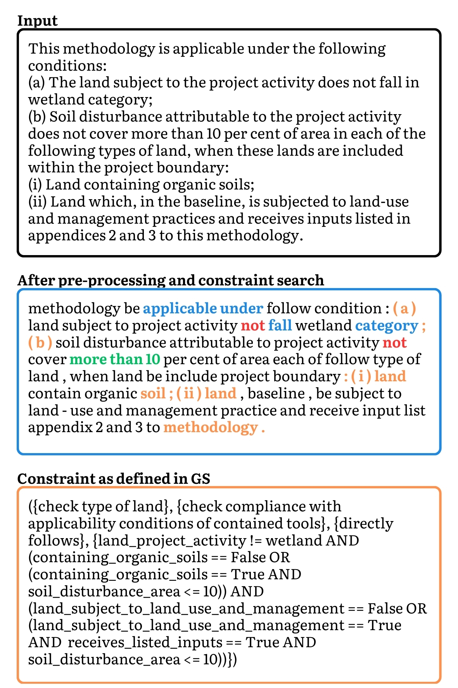
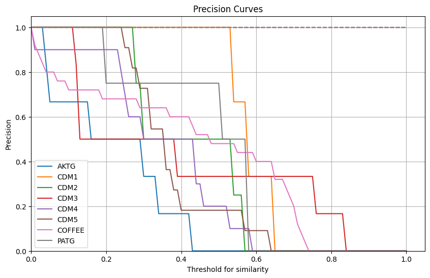
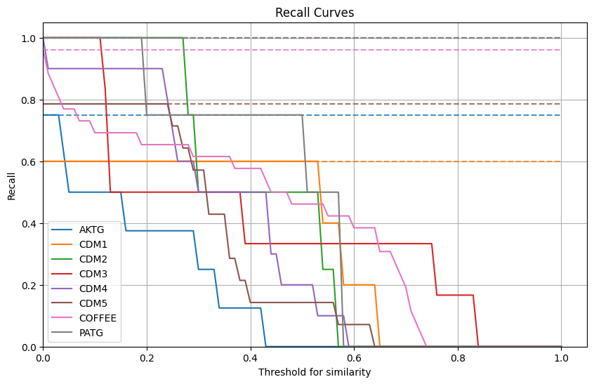

# Rule-based Extraction of Constraints from Regulatory Texts 📚
Deliverable for the TUM WS2023 Master course "Approaching Information System Challenges with Natural Language Processing".

For questions please contact leo.holzhauer@tum.de.

## Table of Contents
- [Abstract 📄](#abstract-)
- [Quick Setup 🚀](#quick-setup-)
  - [1. Clone the Repository 👨‍💻](#1-clone-the-repository-)
  - [2. Setup Virtual Environment with Anaconda 🐍](#2-setup-virtual-environment-with-anaconda-)
  - [3. Install Dependencies with requirements.txt 📦](#3-install-dependencies-with-requirementstxt-)
  - [4. Get Started 🌟](#4-get-started-)
- [Repository Structure 📂](#repository-structure-)
- [Usage Recommendations 💡](#usage-recommendations-)
- [Acknowledgements 🙏](#acknowledgements-)

## [Abstract 📄](#abstract-)

This study tackles the task of extracting and rebuilding constraints from regulatory texts to ensure compliance in business processes, with a focus on certifications within the voluntary carbon market. As the volume of regulatory requirements expands, the necessity for automated systems to interpret these documents becomes evident. A rule-based method, augmented by Generative Pre-trained Transformers (GPT) from OpenAI, is introduced for the systematic identification and reconstruction of constraint items from textual data. The developed data pipeline is modular and scalable, facilitating adaptation to a variety of use cases. Quantitative and qualitative evaluations demonstrate the approach's effectiveness, highlighting its potential benefits and pinpointing opportunities for future enhancements. Incorporating advanced language models adds a new dimension to constraint reconstruction, blending rule-based accuracy with the generative capabilities of machine learning.

<figure>
    
    <figcaption style="text-align: center;"><strong>Figure 1:</strong> Example for a complex constraint and different types of constraint markers</figcaption>
</figure>

<hr>

<figure>
    <figcaption><strong>Figure 2:</strong> Precision and recall curves for a rule-based constraint component building with a variable similarity cutoff. Dotted lines indicated the maximal achievable precision/recall.</figcaption>
    <table style="width: 100%; text-align: center;">
        <tr>
            <td>
                <figure>
                    
                    <figcaption><strong>Figure 2.1:</strong> Precision</figcaption>
                </figure>
            </td>
            <td>
                <figure>
                    
                    <figcaption><strong>Figure 2.2:</strong> Recall</figcaption>
                </figure>
            </td>
        </tr>
    </table>
</figure>


## [Quick Setup 🚀](#quick-setup-)

### [1. Clone the Repository 👨‍💻](#1-clone-the-repository-)
First, you need to clone the repository from GitHub to your local machine.

```
git clone https://github.com/holzhauerL/nlp-rule-extraction.git

cd nlp-rule-extraction
```
This command clones the repository, and then you change your directory to the cloned repository's root directory.

### [2. Setup Virtual Environment with Anaconda 🐍](#2-setup-virtual-environment-with-anaconda-)
Before setting up the virtual environment, ensure you have Anaconda or Miniconda installed on your system. You can download Anaconda from the [official website](https://anaconda.org) or Miniconda from its [official website](https://docs.anaconda.com/free/miniconda/).

To create a new virtual environment using Anaconda, run:

```
conda create --name nlp-rules python=3.10.13
```

Activate the newly created environment with:

```
conda activate nlp-rules
```

### [3. Install Dependencies with requirements.txt 📦](#3-install-dependencies-with-requirementstxt-)
After setting up and activating your virtual environment, the next step is to install the required dependencies. These dependencies are listed in the `requirements.txt` file in the root directory of your cloned repository. Install them using the following command:

```
pip install -r requirements.txt
```
This command reads the requirements.txt file and installs all the listed packages with their specified versions into your virtual environment.

### [4. Get Started 🌟](#4-get-started-)
1. Create a copy of the `pipeline.ipynb` notebook in the same folder (`notebooks`).
1. **Optional**: Add the file information in the notebook, if you added new data. The filenames need to follow the current folder structure and naming convention and need to be in the TXT format. Check out the usage recommendations below.
1. **Optional**: Setup OpenAI API Key. For detailed information, please refer to [this OpenAI article](https://help.openai.com/en/articles/5112595-best-practices-for-api-key-safety).
1. Have fun :D

During the execution of the script, a pretrained spacy pipeline is used for various tasks, such as tokenization. It is automatically downloaded, if not yet present in your local environment. 

The  default is `en_core_web_lg` (large), which takes up to 600 MB of storage. Alternatives for reduced memory usage are `en_core_web_md` (medium) and `en_core_web_sm` (small). However, these were not tested and might reduce performance. 

For more information, please refer to the [spaCy documentation](https://spacy.io/models/en).


## [Repository Structure 📂](#repository-structure-)

```plaintext
nlp-rule-extraction/
├── data/
├── notebooks/
    └── evaluation/
│   └── pipeline.ipynb
├── reports/
    └── figures/tex/
    └── holzhauer2024constraintExtraction.pdf
├── src/
│   ├── __pycache__/
│   ├── __init__.py
│   ├── evaluation.py
│   ├── modelling.py
│   ├── preprocess.py
│   └── utils.py
├── .gitignore
├── LICENSE
├── README.md
└── requirements.txt
```

## [Usage Recommendations 💡](#usage-recommendations-)

1. If you use the OpenAI API, consider running a trial run with `estimation_mode=True`to get a cost estimation.
1. For input data, demark sections with '#' and subsections with '##'. 
1. For input data with enumeration items, restrict yourself to items of the following class 1., (1), (a) and (i). Each enumeration should start with a describtion and a colon (" : ") and there should be a linebreak preceeding each enumeration item.

## [Acknowledgements 🙏](#acknowledgements-)

I would like to thank Catherine Sai for her supervision and mentoring and Jasper Schmieding for his help in collecting the data and creating the gold standard.


